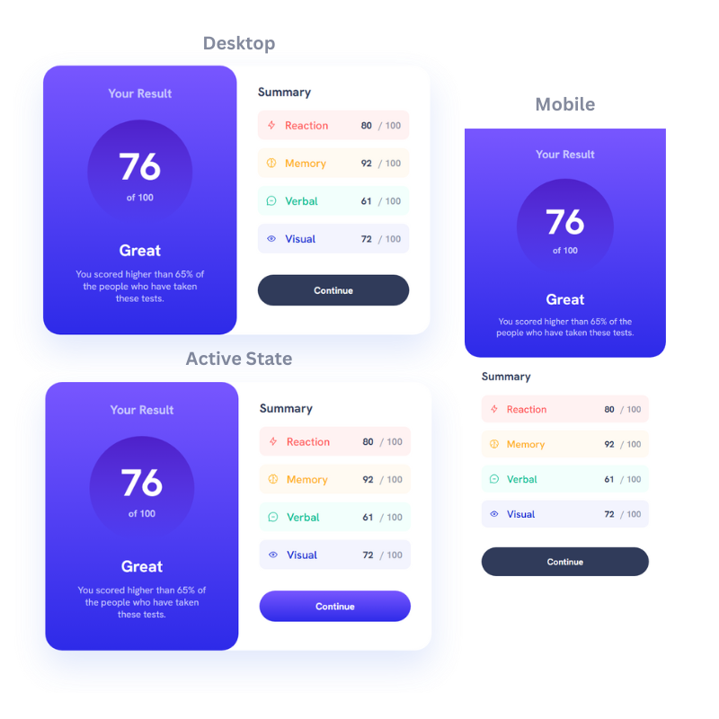

# Frontend Mentor - Results summary component solution

This is a solution to the [Results summary component challenge on Frontend Mentor](https://www.frontendmentor.io/challenges/results-summary-component-CE_K6s0maV). Frontend Mentor challenges help you improve your coding skills by building realistic projects.

## Table of contents

- [Overview](#overview)
  - [The challenge](#the-challenge)
  - [Screenshot](#screenshot)
  - [Links](#links)
- [My process](#my-process)
  - [Built with](#built-with)
  - [What I learned](#what-i-learned)
  - [Continued development](#continued-development)
- [Author](#author)

## Overview

### The challenge

Users should be able to:

- View the optimal layout for the interface depending on their device's screen size
- See hover and focus states for all interactive elements on the page

### Screenshot



### Links

- Solution URL: [Add solution URL here](https://your-solution-url.com)
- Live Site URL: [Add live site URL here](https://your-live-site-url.com)

## My process

### Built with

- Semantic HTML5 markup
- CSS custom properties
- CSS Grid
- CSS Flexbox

### What I learned

I learned how to write clean HTML and CSS code, using CSS utilities classes and CSS Variables (custom properties), for different styles, such as:

- Background color and Text color.
- Font sizes and Text styles.
- CSS Grid and CSS Flexbox.

In this way the CSS elements are not fill with bunch of different CSS properties, and it puts everything in logical order.

I will keep developing this way of writing HTML and CSS - it also make it easy to read the code.

Here some example from the code:

```html
<div class="card-summary-content flex bg-red</>
```

```css
.grid {
  display: grid;
  grid-template-columns: repeat(2, 1fr);
  justify-items: center;
  align-items: center;
}

.card-summary .card-summary-content {
  justify-content: space-between;
  width: 288px;
  height: 56px;
  margin-bottom: 16px;
  padding: 0 16px;
  border-radius: 12px;
}
```

Another example from the code:

```html
<div class="card-summary-content flex bg-red"></div>
<h3 class="text-red">Reaction</h3>
```

```css
:root {
  --red-text: hsl(0, 100%, 67%);
  --red-bg: hsla(0, 100%, 95%, 0.5);
}

.bg-red {
  background-color: var(--red-bg);
}

.text-red {
  color: var(--red-text);
  font-weight: 500;
}
```

### Continued development

I will keep improving my HTML and CSS skills, and learning new tricks and techniques.
I will focusing specifically on mastering CSS Flexbox and Grid techniques and responsive web design.

## Author

- Frontend Mentor - [@rosenblumitamar](https://www.frontendmentor.io/profile/rosenblumitamar)
- Twitter - [@rosenblumitamar](https://x.com/ItamarRosenblum)

**Note: Delete this note and add/remove/edit lines above based on what links you'd like to share.**
